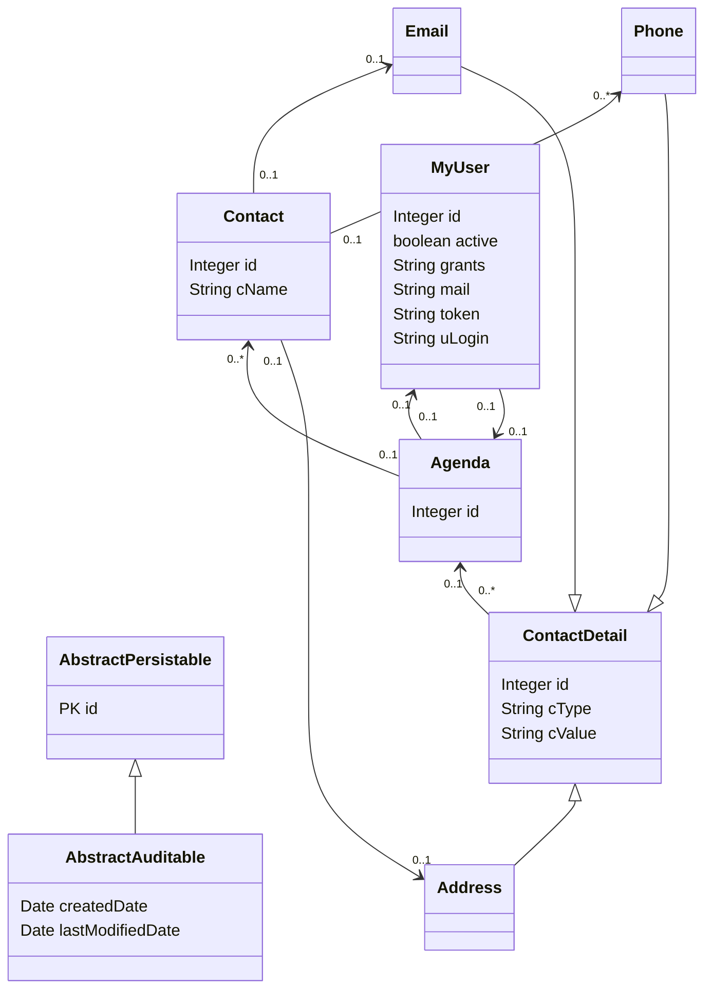

# Objectifs
Lors de cet atelier, l’apprenant doit :  
-  A partir des diagrammes de classes et des diagrammes de composants d’une étude  de cas donnée par l’intervenant, développer et tester les composants de la couche  métier d’une application informatique.

## Sujet
A partir du diagramme de classe suivant , implémentez dans le langage de votre choix la structure logicielle correspondante.

## Cahier des charges:

Nous désirons implanter la gestion d’un agenda:
- un agenda contient un ensemble de personnes nommées `contacts`.
- Un agenda possède un `owner` possédant un login/mot de passe et jwt token.
- Chaque contact est identifié par son nom et par un ensemble de coordonnées
- Une coordonnée peut être postale, téléphonique ou électonique (email ou page web)
- Chaque coordonnées possède une méthode propre permettant de valider le format de saisie. 


# Résultat final:


## Attendus de l'exercice
Dans le langage de votre choix, implémentez les classes liées à ce diagramme.

Vérifiez l'ensemble des méthodes nécessaires pour que l'agenda soit opérationnel.
Que ce soit par des tests ou par un script `main` basique, par exemple : 
```shell
./gradlew :test
```

A partir du code produit, réalisez le diagramme de classe final.
Vous pouvez utiliser des pattern (Factory, MVC, MVVT ...).

## Les consignes ci-dessus sont le minimum attendu
Vous avez des niveaux variés, et les exigences ci-dessus sont minimalistes au vu du temps imparti : 7 heures...
Le travail fourni doit être propre et structuré.
Définissez le scope en amont, il est possible de réaliser les fonctionnalités suivantes en bonus :
 - Implémenter des tests unitaires ou fonctionnels au besoin.
 - Persister les données.
 - Ajouter une api
 - Implémenter un client communiquant avec un back-end simulé.

 

## Livrables attendus
Livraison par le biais d'un dépôt git communiqué au formateur contenant :
 - un fichier README.md expliquant à minima (6pts):
    - comment installer lancer le projet .
    - comment lancer l'executable de votre projet.
    - comment lancer un environnement de dev.
 - le code source de l'application (6pts)
 - le code compilé s'il s'agit d'un langage compilé.
 - le diagramme de classe final. Non pas de vos modèles mais de la structure mise en place. (4pts)

Votre note sera sur 16 pts si vous vous contentez du minimum attendu. 
Les bonus pouvant vous apporter des points supplémentaires.
